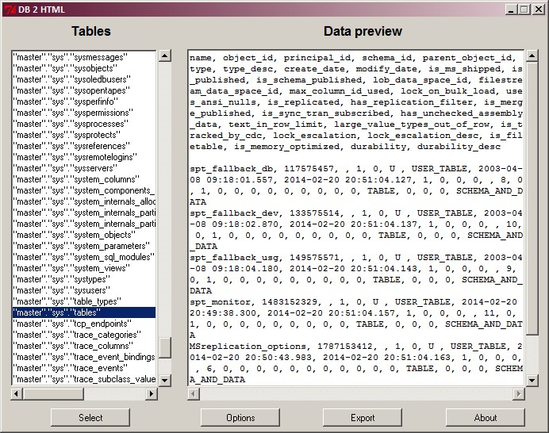

DB2HTML
=======

DB 2 HTML is a utility to export data from a database to HTML. It supports the following databases:

- MS SQL Server
- Oracle Server (requires Oracle 32bits client)
- MySQL
- SQLite 3
- Generic ODBC

### Usage:

Binaries for Windows and Linux are available in the `bin` folder. Simply double click on it.

### Sample:

